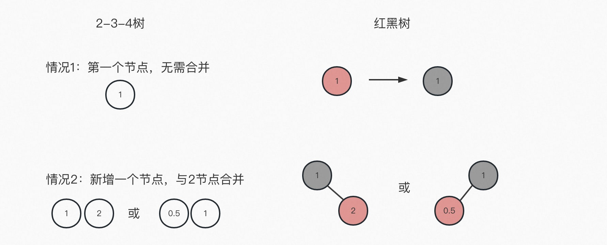

## 红黑树5大性质
1. 节点是红色或黑色
2. 根节点是黑色
3. 所有叶子都是黑色（叶子是NIL节点，一般不画出来）
4. 每个红色节点必须有两个黑色的子节点（从每个叶子到根的所有路径不能有两个连续的红节点）
5. 从任一节点到每个叶子路径包含相同数量的黑节点（黑平衡）


234树与红黑树的对应关系（基础原则要记牢）


## 插入新节点
```java
public V put(K key, V value) {
    // root是成员变量，表示TreeMap的根节点
    Entry<K,V> t = root;

    // 如果当前treeMap为空，没有root节点，当前插入的就是第一个节点
    if (t == null) {
        compare(key, key); // type (and possibly null) check

        root = new Entry<>(key, value, null);
        size = 1;
        modCount++;
        return null;
    }


    int cmp;
    Entry<K,V> parent;
    // split comparator and comparable paths
    Comparator<? super K> cpr = comparator;
    if (cpr != null) {
        // 选择1：自定义比较器的逻辑
        do {
            parent = t;
            cmp = cpr.compare(key, t.key);
            if (cmp < 0)
                t = t.left;
            else if (cmp > 0)
                t = t.right;
            else
                return t.setValue(value);
        } while (t != null);
    }
    else {
        // 选择2：使用系统比较器的逻辑
        if (key == null)
            throw new NullPointerException();
        @SuppressWarnings("unchecked")
            Comparable<? super K> k = (Comparable<? super K>) key;

        do {
            // parent指向t的当前位置（从root开始往下找）
            parent = t;
            // 插入的key和当前位置（从root开始）比较
            cmp = k.compareTo(t.key);
            // 根据key的比较，决定t往左下寻找还是往右下寻找
            if (cmp < 0)
                // t往当前节点的左边往下找
                t = t.left;
            else if (cmp > 0)
                // t往当前节点的右边往下找
                t = t.right;
            else
                // 因为是map，key唯一，出现key相同，则直接覆盖value
                return t.setValue(value);
        
        // 如果t已经到了叶子节点（最后一层节点的再下面的空节点），退出循环
        } while (t != null);
    }

    // 没有发现已经存在的key，且已经到了应该追加的位置
    // new一个新节点出来（e的parent指向刚刚一直跟着走的parent指针指向的位置）
    Entry<K,V> e = new Entry<>(key, value, parent);
    // 根据t在parent的左下边还是右下边，决定parent的孩子节点的指向
    // 插入之前，parent的左孩或右孩节点应该是指向空的，现在需要指向新增的e节点
    if (cmp < 0)
        parent.left = e;
    else
        parent.right = e;
    
    // 重新作色和调整位置（红黑树的重点）
    fixAfterInsertion(e);
    size++;
    modCount++;
    return null;
}
```
### 新增节点的几种情况：



1. 新增的是第一个节点：无需调整，默认就是黑色
2. 234树是2节点，新增节点与之合并成3节点：新增红色，父亲黑色，上黑下红规则满足，无需调整
3. 234树是3节点，新增节点与之合并成4节点：新增红色，如果父亲红色，需要调整；如果父亲黑色，不需要调整
4. 234树是4节点，新增节点发生裂变：原4节点对应的红黑树是稳定的上黑下红形态，所以新增的红色节点父亲一定是红色，需要调整


## 插入新节点后进行调整
```java
private void fixAfterInsertion(Entry<K,V> x) {
    // 新增节点都是红色的
    x.color = RED;

    // 父亲是红色，新加的又是红色，出现红红相连，才需要调整
    // 上面2/3/4几种情况中，父亲是黑色的情况，都不需要调整
    while (x != null && x != root && x.parent.color == RED) {
        // 插入节点的父亲是爷爷的左孩，有几种可能
        // 1. 情况3的A/B
        // 2. 情况4的A/B
        if (parentOf(x) == leftOf(parentOf(parentOf(x)))) {
            // 叔叔节点
            Entry<K,V> y = rightOf(parentOf(parentOf(x)));
            
            if (colorOf(y) == RED) {
                // 情况4的A/B，叔叔存在
                // 这种变化颜色即可: 爷爷变成红（爷爷如果是root，最后还是会变黑），父亲和叔叔变黑
                // 为什么不插入的x变黑就行了？这样的话就不黑平衡了，父亲分支路径黑色会比叔叔分支黑色多一个,所以要求新增的节点都是红色
                setColor(parentOf(x), BLACK);
                setColor(y, BLACK);
                setColor(parentOf(parentOf(x)), RED);

                // x指向爷爷，从下往上调整
                // 为什么爷爷要调整，因为爷爷变红了，可能导致两个红相连
                x = parentOf(parentOf(x));
            } else {
                // 情况3的A/B，叔叔不存在
                // 注意colorOf默认是黑色，即叔叔节点不存在会进入这个else逻辑

                // 情况3的B，以x的父亲为中心左旋
                // x的父亲降下去到x的兄弟位置，x的父亲的右孩（x）顶替原父亲位置
                // 结果就是变成情况3的A
                if (x == rightOf(parentOf(x))) {
                    x = parentOf(x);
                    rotateLeft(x);
                }

                // 接下来情况3的A和B都按A处理
                // 变色：x的父亲变黑，爷爷变红
                setColor(parentOf(x), BLACK);
                setColor(parentOf(parentOf(x)), RED);

                // 为什么变成红黑红以后，还不是终态呢？
                // 因为这个else逻辑分支是叔叔不存在，则爷爷的右孩分支路径比父亲的任意分支路径少一个黑色，没有黑平衡（或者说违背了性质4：每个红色节点必须有两个黑色的子节点）

                // 所以变色后的A要右旋，变成C，成为稳定态
                rotateRight(parentOf(parentOf(x)));
            }
        } else {
            // 情况3：D/E 或情况4：C/D

            // 叔叔节点
            Entry<K,V> y = leftOf(parentOf(parentOf(x)));

            if (colorOf(y) == RED) {
                // 情况4：C/D，类似上面情况4：A/B处理
                setColor(parentOf(x), BLACK);
                setColor(y, BLACK);
                setColor(parentOf(parentOf(x)), RED);
                x = parentOf(parentOf(x));
            } else {
                // 情况3的D/E，类似上面情况3：A/B处理
                if (x == leftOf(parentOf(x))) {
                    x = parentOf(x);
                    rotateRight(x);
                }
                setColor(parentOf(x), BLACK);
                setColor(parentOf(parentOf(x)), RED);
                rotateLeft(parentOf(parentOf(x)));
            }
        }
    }

    // 根节点一定是黑色的
    root.color = BLACK;
}
```


## 删除节点

### 二叉树的删除有以下几种情况
- 情况1. 删除叶子节点，直接删除操作
- 情况2. 删除的节点有一个子节点，则用子节点替换被删的节点
- 情况3. 删除的节点有两个子节点，则需要找到"前驱"或"后继"节点来替换待删除节点


情况3理论上是用前驱或后继节点替换当前待删除节点，还有个简化版的“复制值”方案（这里以后继节点为例，前驱节点类似）：

删除当前节点，等价于用B节点的kv值覆盖到当前节点，然后再删除B节点。此时删除B节点，如果其子节点C节点存在，则等价于情况2，否则等价于情况1。

- 注意1：情况3中，B节点要么没有子节点C，要么只有一个子节点C，不可能有两个子节点，否则另外一个子节点更有资格成为后继节点。
- 注意2：情况3中，虽然根据后继节点查找法可能来源于右子节点，也可能来源于右父节点，但是情况3这里后继节点不可能来源于待删节点的父节点，因为前提是待删节点有2个子节点，根据后面讲的后继节点查找法可以看到，子节点更优先于父节点成为前驱或后继节点。


```java
public V remove(Object key) {
    Entry<K,V> p = getEntry(key);
    if (p == null)
        return null;

    V oldValue = p.value;
    deleteEntry(p);
    return oldValue;
}

private void deleteEntry(Entry<K,V> p) {
    modCount++;
    size--;
    
    // 情况3，待删节点有2个子节点，用后继节点替换该节点
    // 由前面分析知，情况3的后继节点不可能有2个子节点（否则其中一个子节点更靠近待删除节点，更有资格是后继节点）
    // 所以情况3进行值替换后，待删除节点变成了只有1个子节点或没有子节点的后继节点，退化成情况2或情况1
    if (p.left != null && p.right != null) {
        Entry<K,V> s = successor(p);
        // 这里用“节点替换操作”的简化版操作，直接复制后继节点的值然后删除后继节点
        p.key = s.key;
        p.value = s.value;

        // 删除后继节点(把p指向后继节点，和后续操作合并)
        p = s;
    }

    // 如果是情况3：处理完成后，p指向后继节点，退化到情况1或情况2
    // 如果本来就是情况1或情况2，从这里开始处理

    // Start fixup at replacement node, if it exists.
    Entry<K,V> replacement = (p.left != null ? p.left : p.right);

    if (replacement != null) {
        // 情况2：待删节点有一个子节点
        // 用子节点替换原待删节点

        // 双向指针互相指
        replacement.parent = p.parent;
        if (p.parent == null)
            root = replacement;
        else if (p == p.parent.left)
            p.parent.left  = replacement;
        else
            p.parent.right = replacement;

        // Null out links so they are OK to use by fixAfterDeletion.
        p.left = p.right = p.parent = null;

        // 只有删除的是黑色才需要调整
        // 1. 删了黑色才有可能导致黑平衡失败（不同路径黑色节点个数不同）
        // 2. 删了黑色才有可能导致两个红色挨着
        if (p.color == BLACK)
            fixAfterDeletion(replacement);

    } else if (p.parent == null) { // return if we are the only node.
        // 只有根节点的父节点为空，删除当前节点就是删除根节点
        root = null;
    } else { //  No children. Use self as phantom replacement and unlink.
        // 进入这里，表示待删节点没有子节点，直接删除p就行，但是这里和调整做了点合并逻辑，写到一起了
        
        if (p.color == BLACK)
            fixAfterDeletion(p);

        // 双向指针互删
        if (p.parent != null) {
            if (p == p.parent.left)
                p.parent.left = null;
            else if (p == p.parent.right)
                p.parent.right = null;
            p.parent = null;
        }
    }
}
```

## 删除节点后进行调整
```java
private void fixAfterDeletion(Entry<K,V> x) {
    while (x != root && colorOf(x) == BLACK) {
        if (x == leftOf(parentOf(x))) {
            Entry<K,V> sib = rightOf(parentOf(x));

            if (colorOf(sib) == RED) {
                setColor(sib, BLACK);
                setColor(parentOf(x), RED);
                rotateLeft(parentOf(x));
                sib = rightOf(parentOf(x));
            }

            if (colorOf(leftOf(sib))  == BLACK &&
                colorOf(rightOf(sib)) == BLACK) {
                setColor(sib, RED);
                x = parentOf(x);
            } else {
                if (colorOf(rightOf(sib)) == BLACK) {
                    setColor(leftOf(sib), BLACK);
                    setColor(sib, RED);
                    rotateRight(sib);
                    sib = rightOf(parentOf(x));
                }
                setColor(sib, colorOf(parentOf(x)));
                setColor(parentOf(x), BLACK);
                setColor(rightOf(sib), BLACK);
                rotateLeft(parentOf(x));
                x = root;
            }
        } else { // symmetric
            Entry<K,V> sib = leftOf(parentOf(x));

            if (colorOf(sib) == RED) {
                setColor(sib, BLACK);
                setColor(parentOf(x), RED);
                rotateRight(parentOf(x));
                sib = leftOf(parentOf(x));
            }

            if (colorOf(rightOf(sib)) == BLACK &&
                colorOf(leftOf(sib)) == BLACK) {
                setColor(sib, RED);
                x = parentOf(x);
            } else {
                if (colorOf(leftOf(sib)) == BLACK) {
                    setColor(rightOf(sib), BLACK);
                    setColor(sib, RED);
                    rotateLeft(sib);
                    sib = leftOf(parentOf(x));
                }
                setColor(sib, colorOf(parentOf(x)));
                setColor(parentOf(x), BLACK);
                setColor(leftOf(sib), BLACK);
                rotateRight(parentOf(x));
                x = root;
            }
        }
    }

    setColor(x, BLACK);
}
```


## 旋转算法
```java
private void rotateLeft(Entry<K,V> p) {
    if (p != null) {
        // 左旋，p落下去（到原来的左孩位置），p的右孩顶替它的原来位置
        Entry<K,V> r = p.right;

        // p的右孩的左孩挂到p的右孩
        // 因为旋转前，p的右孩（r）及其子孙都比p大，大小关系：p的右孩>p的右孩的左孩>p
        // 所以旋转后，p的右孩（r）占了p的原有位置，r的原左孩及p都位于r的左侧，但是p更小，所以r的原左孩新的位置是p的右孩（大小介于p和r之间）
        p.right = r.left;

        // 双向指针，还需要反着指一下
        if (r.left != null)
            r.left.parent = p;

        // r占了p的位置，双向指针，r的父需要改成原p的父
        r.parent = p.parent;

        // 双向指针，还需要反着指一下（需要分左右两种情况）
        if (p.parent == null)
            root = r;
        else if (p.parent.left == p)
            p.parent.left = r;
        else
            p.parent.right = r;

        // 双向指针，r的左指向p，p的父指向r 
        r.left = p;
        p.parent = r;
    }
}

private void rotateRight(Entry<K,V> p) {
    if (p != null) {
        // 右旋，p落下去（到原来的右孩位置），p的左孩顶替它的原来位置
        Entry<K,V> l = p.left;

        // p的左孩的右孩挂到p的左孩
        // 因为旋转前，p的左孩（l）及其子孙都比p小，大小关系：p的左孩<p的左孩的右孩<p
        // 所以旋转后，p的左孩（l）占了p的原有位置，l的原右孩及p都位于l的右侧，但是p更大，所以l的原右孩新的位置是p的左孩（大小介于l和p之间）
        p.left = l.right;

        // 双向指针，还需要反着指一下
        if (l.right != null) l.right.parent = p;

        // l占了p的位置，双向指针，l的父需要改成原p的父
        l.parent = p.parent;

        // 双向指针，还需要反着指一下（需要分左右两种情况）
        if (p.parent == null)
            root = l;
        else if (p.parent.right == p)
            p.parent.right = l;
        else p.parent.left = l;

        // 双向指针，l的右指向p，p的父指向l
        l.right = p;
        p.parent = l;
    }
}
```

## 查找算法
### 查前驱
由二叉搜索树性质可以知道，中序遍历树的结果是一个递增序列。
> 中序遍历：左、中、右
https://blog.csdn.net/u014384625/article/details/117983045?spm=1001.2014.3001.5502


不管是查前驱还是查后驱，牢记中序遍历走法，找离自己最近的那个点即可。


前驱是指小于当前节点的集合中最大的节点

1. 按中序遍历的走法，如果有左孩群，且父亲来源于左侧（情况1），则中序遍历走法是先父亲群（C群），再自己左孩群（D群），再自己，最后右孩群（E群）；
2. 如果有左孩群，且父亲来源于右侧（情况2），则中序遍历的走法是先左孩群（D群），再自己，再右孩群（E群），再回到父亲群（C群）

所以只要有左孩群，离自己最近的且小于自己的，一定来源于左孩群，且按中序走法，其中最大的一定是最右的那个节点

3. 要是没有左孩群，则前驱点一定来源于父群；并且一定是来自于第一个左边父辈，比如情况1的C、或情况2的A
（回忆中序走法，有左边父辈，从父辈节点角度看就是往右走，因为目标节点没左孩，所以要么第一个就是目标（情况1），要么右走一步，再左走任意步，最先都是和目标碰头（最近）


```java
static <K,V> Entry<K,V> predecessor(Entry<K,V> t) {
    if (t == null)
        return null;
    else if (t.left != null) {
        // 如果有左孩群，则找左孩群中最右的那个
        Entry<K,V> p = t.left;
        while (p.right != null)
            p = p.right;
        return p;
    } else {
        // 没有左孩群，再找第一个左偏的父，找不到就是null
        Entry<K,V> p = t.parent;
        Entry<K,V> ch = t;
        while (p != null && ch == p.left) {
            ch = p;
            p = p.parent;
        }
        return p;
    }
}
```
### 查后驱
后驱是指大于当前节点的集合中最小的节点
```java
static <K,V> TreeMap.Entry<K,V> successor(Entry<K,V> t) {
    if (t == null)
        return null;
    else if (t.right != null) {
        Entry<K,V> p = t.right;
        while (p.left != null)
            p = p.left;
        return p;
    } else {
        Entry<K,V> p = t.parent;
        Entry<K,V> ch = t;
        while (p != null && ch == p.right) {
            ch = p;
            p = p.parent;
        }
        return p;
    }
}
```
