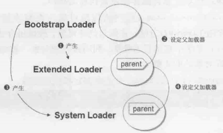

- [java内存模型](#java内存模型)
- [垃圾回收：](#垃圾回收)
    - [新GC器](#新gc器)
- [java 监控排查工具](#java-监控排查工具)
- [JVM参数设置（调优）](#jvm参数设置调优)
- [类创建流程](#类创建流程)
  - [类创建流程：](#类创建流程-1)
  - [类加载时机: 虚拟机规范中并没有对此进行强制约束](#类加载时机-虚拟机规范中并没有对此进行强制约束)
  - [类加载器：](#类加载器)
  - [获取类加载器](#获取类加载器)
  - [JVM启动后，类加载器的创建顺序如下：](#jvm启动后类加载器的创建顺序如下)
  - [类初始化时机:](#类初始化时机)
  - [类的初始化步骤：](#类的初始化步骤)
- [对象创建流程](#对象创建流程)
  - [对象创建时机：](#对象创建时机)
  - [对象创建流程：](#对象创建流程-1)
- [String为何设置成不可变](#string为何设置成不可变)

# java内存模型
> https://blog.csdn.net/javazejian/article/details/72772461
> https://zhuanlan.zhihu.com/p/519803985

    java内存区域：堆、方法区（包含常量池）、栈区（本地方法栈、JVM栈）、程序计数器
    java内存模型JMM：抽象概念，分为主内存和各个线程的工作内存 ，线程从主内存拷贝共享变量到工作内存中处理后再写回主内存

# 垃圾回收：
> https://blog.csdn.net/qq_35246620/article/details/80522720
标记-清除、标记-整理（老年代）、复制法（青年代）
查看GC器：java -XX:+PrintCommandLineFlags -version (默认ParNew+CMS)

ParNew：复制算法，用于青年代
CMS：标记清理，用于老年代

### 新GC器
G1、ZGC，之前的是将堆分代，而G1和ZGC是将堆分区
- G1
   > https://blog.csdn.net/xiaofeng10330111/article/details/106081590
   > https://blog.csdn.net/coderlius/article/details/79272773
   > https://blog.csdn.net/renfufei/article/details/41897113
- ZGC
   > https://blog.csdn.net/A_art_xiang/article/details/134848087
   > https://blog.csdn.net/jiangyq_/article/details/136163362
   > https://blog.csdn.net/xiaofeng10330111/article/details/105360860


# java 监控排查工具
> https://javakeeper.starfish.ink/java/JVM/JVM%E6%80%A7%E8%83%BD%E7%9B%91%E6%8E%A7%E5%92%8C%E6%95%85%E9%9A%9C%E5%A4%84%E7%90%86%E5%B7%A5%E5%85%B7.html#%E5%9F%BA%E7%A1%80%E6%95%85%E9%9A%9C%E5%A4%84%E7%90%86%E5%B7%A5%E5%85%B7

todo

# JVM参数设置（调优）
    https://blog.csdn.net/v123411739/article/details/123778478
    -Xms、-Xmx 堆初始、最大内存，设置到host内存3/4，设置成一样的值，避免动态伸缩带来的性能损失（空间不够向操作系统申请的时候还会发生GC）
    -Xmn 新生代大小 设置到整个堆大小的 3/8
    -XX:NewRatio=2，年轻代:老年代=1:2
    -XX:SurvivorRatio=8，eden:survivor=8:1 

    每次YGC耗时在100ms以内，50ms以内尤佳
    FGC最多几小时1次，1天不到1次尤佳
    每次FGC耗时在1s以内，500ms以内尤佳
    

# 类创建流程
> https://blog.csdn.net/justloveyou_/article/details/72466105
> https://blog.csdn.net/justloveyou_/article/details/72466416

## 类创建流程：

当类加载器有加载任务时，会先把加载任务交给父加载器，如果父加载器无法加载，才由自己加载。
所以加载类的时候，会以Bootstrap Loader -> Extended Loader -> System Loader的加载类。
如果所有加载器加载类失败，抛出java.lang.NoClassDefFoundError异常。
  
   加载 ->（验证 -> 准备 -> 解析）-> 初始化 -> 使用 -> 卸载 （括号里面的三步统称：连接）

  - 加载：类的二进制字节流，转换成方法区的数据结构
  - 验证：格式规范验证
  - 准备：为类变量(static 成员变量)分配内存并设置类变量初始值（零值，不是代码写的初始值）
  - 解析：将常量池内的符号引用替换为直接引用
  - 初始化：见后续类的初始化步骤

## 类加载时机: 虚拟机规范中并没有对此进行强制约束
## 类加载器：
  - Bootstrap ClassLoader
    - 这个类加载使用 C/C++ 语言实现，嵌套在 JVM 内部
    - 它用来加载 Java 的核心库（JAVA_HOME/jre/lib/rt.jar、resource.jar或sun.boot.class.path路径下的内容），用于提供 JVM 自身需要的类
    - 并不继承自 java.lang.ClassLoader，没有父加载器
    - 加载扩展类和应用程序类加载器，并指定为他们的父类加载器
    - 出于安全考虑，Bootstrap 启动类加载器只加载名为 java、Javax、sun 等开头的类 
  - Extension ClassLoader
    - Java 语言编写，由 sun.misc.Launcher$ExtClassLoader 实现
    - 派生于 ClassLoader
    - 父类加载器为启动类加载器
    - 从 java.ext.dirs 系统属性所指定的目录中加载类库，或从 JDK 的安装目录的 jre/lib/ext 子目录（扩展目录）下加载类库。如果用户创建的 JAR 放在此目录下，也会自动由扩展类加载器加载
  - AppClassLoader
    - java 语言编写，由 sun.misc.Lanucher$AppClassLoader 实现
    - 派生于 ClassLoader
    - 父类加载器为扩展类加载器
    - 它负责加载环境变量 classpath 或系统属性 java.class.path 指定路径下的类库
    - 该类加载是程序中默认的类加载器，一般来说，Java 应用的类都是由它来完成加载的
    - 通过 ClassLoader#getSystemClassLoader() 方法可以获取到该类加载器
  - ContextClassLoader
    - Thread.currentThread().getContextClassLoader() 获取
    - 默认为AppClassLoader
    - 以SPI为例，SPI接口属于Java核心库，由BootstrapClassLoader加载，当SPI接口想要引用第三方实现类的具体方法时，BootstrapClassLoader无法加载Classpath下的第三方实现类，这时就需要使用线程上下文类加载器ContextClassLoader来解决。借助这种机制可以打破双亲委托机制限制
    - SPI核心类ServiceLoader源码如下：
      ```java
      public final class ServiceLoader<S>
         implements Iterable<S>
      {
      
         public static <S> ServiceLoader<S> load(Class<S> service) {
               // 线程上下文类加载器,在Launcher类的构造器中被赋值为AppClassLoader,它可以读到ClassPath下的自定义类
            ClassLoader cl = Thread.currentThread().getContextClassLoader();
            return ServiceLoader.load(service, cl);
         } 
      ```

  - 用户自定义类加载器
    - 以应用类加载器AppClassLoader作为父加载器
    - 为什么要自定义类加载器？
      - 隔离加载类
      - 修改类加载的方式
      - 扩展加载源（可以从数据库、云端等指定来源加载类）
      - 防止源码泄露（Java 代码容易被反编译，如果加密后，自定义加载器加载类的时候就可以先解密，再加载）
    - 用户自定义加载器实现步骤
      - 开发人员可以通过继承抽象类 java.lang.ClassLoader 类的方式，实现自己的类加载器，以满足一些特殊的需求
      - 在 JDK1.2 之前，在自定义类加载器时，总会去继承 ClassLoader 类并重写 loadClass() 方法，从而实现自定义的类加载类，但是 JDK1.2 之后已经不建议用户去覆盖 loadClass() 方式，而是建议把自定义的类加载逻辑写在 findClass() 方法中
      - 编写自定义类加载器时，如果没有太过于复杂的需求，可以直接继承 URLClassLoader 类，这样就可以避免自己去编写 findClass() 方法及其获取字节码流的方式，使自定义类加载器编写更加简洁

URLClassLoader类创建实例时，需要java.net.URL数组作为参数指定新的类加载搜索路径。
```java
ClassLoader loader = new URLClassLoader(new URL[] {new URL(pathA), new URL(pathB)});

loader.loadClass(clzName);
```

URLClassLoader类的实例，将由Bootstrap Loader创建，指定父加载器为System Loader
由于使用URL协议，可以指定远程服务器上的类文件，使用本地路径时，注意添加前缀"file:/"

## 获取类加载器
可以使用getParent()获取类加载器的父加载器。

自定义对象默认用System Loader加载，可以使用Class.getClassLoader()获取加载该类的类加载器。

```java
// 获取System Loader
ClassLoader sysClassLoader = Empty.class.getClassLoader();
// 也可以这样获取：
ClassLoader sysClassLoader = ClassLoader.getSystemClassLoader();

// 获取Extended Loader
ClassLoader extClassLoader = sysClassLoader.getParent();

// 获取Bootstrap Loader
ClassLoader bootClassLoader = extClassLoader.getParent();

System.out.println(sysClassLoader);
// 输出：sun.misc.Launcher$AppClassLoader@73d16e93
System.out.println(extClassLoader);
// 输出：sun.misc.Launcher$ExtClassLoader@15db9742
System.out.println(bootClassLoader);
// 输出：null

获取Extended Loader的父加载器时，返回值为null，但并不代表它没父加载器。因为Bootstrap Loader通常由C实现，在Java中没实际类实例来表示，所有会显示null。

标准API的类（包括数组对象，包装器），都是由Bootstrap Loader加载的。

// 以下均输出null
System.out.println(String.class.getClassLoader());
System.out.println(int[].class.getClassLoader());
System.out.println(Integer.class.getClassLoader());
System.out.println(Class.class.getClassLoader());
```

## JVM启动后，类加载器的创建顺序如下：

1. JVM创建Bootstrap Loader；
2. 由Bootstrap Loader创建Extended Loader；
3. 设置Bootstrap Loader为Extended Loader的父类；
5. 用Bootstrap Loader创建System Loader；
6. 设置Extended Loader为System Loader的父类。




## 类初始化时机: 
  - 使用new关键字实例化对象的时候
  - 读取或设置一个类的静态字段（被final修饰，已在编译器把结果放入常量池的静态字段除外）的时候
  - 调用一个类的静态方法的时候
  - 使用java.lang.reflect包的方法对类进行反射调用的时候
  - 当初始化一个类的时候，如果发现其父类还没有进行过初始化，则需要先触发其父类的初始化
  - 当虚拟机启动时，用户需要指定一个要执行的主类（包含main()方法的那个类），虚拟机会先初始化这个主类
  - 

## 类的初始化步骤：
> https://zhuanlan.zhihu.com/p/556031463
1. 父类的静态变量 -> 2. 父类的静态代码块 -> 3. 子类的静态变量 -> 4. 子类的静态代码块 -> 5. 父类的非静态变量 -> 6. 父类的非静态代码块 -> 7. 父类的构造函数 -> 8. 子类的非静态变量 -> 9. 子类的非静态代码块 -> 10. 子类的构造函数
   

# 对象创建流程
> https://blog.csdn.net/justloveyou_/article/details/72466416

## 对象创建时机：
  - 使用new关键字创建对象
  - newInstance方法(反射机制)
  - 使用Clone方法创建对象
  - 使用(反)序列化机制创建对象

## 对象创建流程：
  
类加载 -> 内存分配(指针碰撞、空闲列表) -> 初始化默认值 -> 设置对象头 -> 执行初始化方法

  - 遇到 new 指令时，首先检查这个指令的参数是否能在常量池中定位到一个类的符号引用，并且检查这个符号引用代表的类是否已经被加载、解析和初始化过。如果没有，执行相应的类加载。
  - 类加载检查通过之后，为新对象分配内存(内存大小在类加载完成后便可确认)。在堆的空闲内存中划分一块区域(‘指针碰撞-内存规整’或‘空闲列表-内存交错’的分配方式)。
  - 前面讲的每个线程在堆中都会有私有的分配缓冲区(TLAB)，这样可以很大程度避免在并发情况下频繁创建对象造成的线程不安全。
  - 存空间分配完成后会初始化为 0(不包括对象头)，接下来就是填充对象头，把对象是哪个类的实例、如何才能找到类的元数据信息、对象的哈希码、对象的 GC 分代年龄等信息存入对象头。
  - 执行 new 指令后执行 init 方法后才算一份真正可用的对象创建完成。

   
   父类的类构造器<clinit>() -> 子类的类构造器<clinit>() -> 父类的成员变量和实例代码块 -> 父类的构造函数 -> 子类的成员变量和实例代码块 -> 子类的构造函数。

   推荐：
   https://blog.csdn.net/q160336802/article/details/123054729

   

# String为何设置成不可变
      a. 为了性能，String缓存在堆上的字符串池中，多个地址引用同一个字符串，如果可变，将会影响多个地方
      b. 大量Hash结构，用到了String的hashCode方法，为了性能，同一个String，缓存了hashCode的结果，如果可变将导致hash映射错误
      c. 安全性，铭感信息大多用字符串存储，保证不可变更安全

   1.7 自定义类加载器的使用场景：
      - 隔离依赖冲突
      - 热加载、热部署
      - 加密保护


