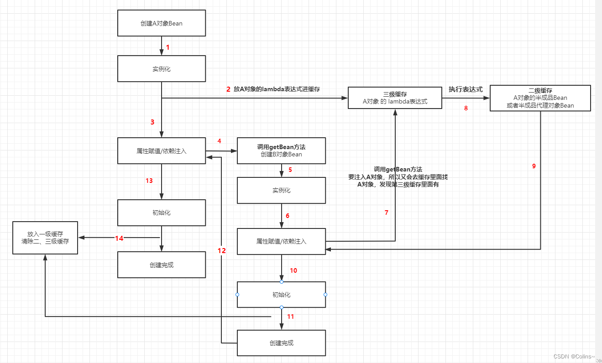

- [spring bean 生命周期](#spring-bean-生命周期)
- [spring 事务](#spring-事务)
  - [原理](#原理)
  - [事物结束勾子：](#事物结束勾子)
- [SpringBoot为什么能运行jar包](#springboot为什么能运行jar包)
- [SpringBoot启动流程](#springboot启动流程)
  - [三种方式](#三种方式)
  - [流程](#流程)
- [spring 解决循环依赖](#spring-解决循环依赖)
- [Spring 加载外部bean \& 自定义context](#spring-加载外部bean--自定义context)
- [SpringMVC修改返回值](#springmvc修改返回值)


# spring bean 生命周期
    https://blog.csdn.net/weixin_44145478/article/details/120217272


#  spring 事务
## 原理
   https://blog.csdn.net/weixin_51423778/article/details/128226788

   https://www.zhengw-tech.com/2020/03/29/spring-transaction/

   流程：
   1. 利用所配置的PlatformTransactionManager事务管理器获取一个数据库连接
   2. 修改数据库连接的autocommit为false
   3. 执行业务方法（）TransactionCallback.doInTransaction
   4. 如果没有抛异常，则提交 / 如果抛了异常，则回滚

   底层原理：
   接口：PlatformTransactionManager -> JDBC实现：DataSourceTransactionManager -> 用到：TransactionSynchronizationManager -> 用到：ThreadLocal
      -> ThreadLocal保存：ConnectionHolder -> ConnectionHolder判断是否有激活态的事务，处理不同的传播级别

    事务嵌套：
    org.springframework.transaction.support.AbstractPlatformTransactionManager#handleExistingTransaction

如果是PROPAGATION_REQUIRES_NEW：

- suspend现在的事务，即把resource unbind
    org.springframework.transaction.support.TransactionSynchronizationManager#unbindResource

    resource 就是 org.springframework.transaction.support.TransactionSynchronizationManager#resources
    也就是一个ThreadLocal，保存的Map，key是dataSource，value是connectionHolder

- start一个新的事务 org.springframework.transaction.support.AbstractPlatformTransactionManager#startTransaction
    - 建立一个新的数据库连接
    - new一个connectionHolder
    - autocommit设置为false
    - bind resource


## 事物结束勾子：
org.springframework.transaction.support.AbstractPlatformTransactionManager#commit

processRollback或者processCommit

调用org.springframework.transaction.support.TransactionSynchronizationUtils里面的：triggerBeforeCommit、triggerBeforeCompletion 等等

最终调用TransactionSynchronization的事务勾子

开发者可以通过 TransactionSynchronizationManager.registerSynchronization 注册 TransactionSynchronization 实现类，这样在相应事务阶段，Spring 就会自动调用对应的方法。

# SpringBoot为什么能运行jar包
      通过spring-boot-maven-plugin打包，生成springboot类型的xxx.jar和xxx.jar.original的常规jar
      A. 常规jar构成：按包名层次结构的.class文件 + 工程目录resources下面的文件
         resources下面有个META-INF文件夹，里面有MANIFEST.MF文件，指定了Main-Class的包路径，找到运行起点
      B. SpringBoot的jar构成：顶层有BOOT-INF + META-INF + org.springframework.boot.loader目录
         B-1:BOOT-INF: 1.里面包含有classes子文件夹，下面内容和常规jar一样； 2.里面还包含lib文件夹，包含里依赖的jar包 3.classpath.idx和layers.idx两个索引文件
         B-2:META-INF: 类似常规jar，除了Main-class指定的是：org.springframework.boot.loader.JarLauncher
         B-3:org.springframework.boot.loader目录:springboot的启动类，主要是JarLauncher.class

         JarLauncher：
            为什么要定义Jarlauncher:java本身可以加载嵌套的class文件，但是jar包里面嵌套的jar就没有通用方法去加载。
            JarLauncher流程：用handler加载jar包 -> 新建classLoader加载jar包里面的class -> 执行我们申明的Springboot启动类

# SpringBoot启动流程
> https://blog.csdn.net/weixin_44947701/article/details/124055713
> https://blog.csdn.net/a745233700/article/details/113761271

## 三种方式
- @EnableAutoConfiguration
- @ComponentScan
- @SpringBootApplication （组合了上面两种注解）

## 流程
1. 准备环境：prepareEnvironment()
   1. 【扩展点】EnvironmentPostProcessor.postProcessEnvironment() 
        >https://blog.csdn.net/yhahaha_/article/details/88578431
        >https://blog.csdn.net/dreambyday/article/details/127621095
2. 准备上下文：prepareContext()
   1. 【扩展点】ApplicationContextInitializer.initialize()
   2. 因为是在bean的刷新之前调用的，类似EnvironmentPostProcessor，通常也用来做一些配置属性的操作
   3. load()加载BeanDefinition
3. 刷新上下文：refreshContext（）：bean的实例化、属性注入等（refresh()）
   1. 准备beanFactory: prepareBeanFactory()
   2. 执行 invokeBeanFactoryPostProcessors()
      1. 【扩展点】BeanDefinitionRegistryPostProcessor
         1. 这个接口在读取项目中的beanDefinition之后执行，提供一个补充的扩展点，动态注册自己的beanDefinition，可以加载classpath之外的bean
            > https://blog.csdn.net/hsz2568952354/article/details/124179271
            > https://blog.csdn.net/u014365523/article/details/118683004
      2. 【扩展点】BeanFactoryPostProcessor
         1. Bean实例化之前执行，所有的bd已经全部加载完毕，然后可以对这些bd做一些属性的修改或者添加工作
            > https://blog.csdn.net/weixin_37862824/article/details/123531719
            > https://blog.csdn.net/Weixiaohuai/article/details/122249603
   3. 注册BeanPostProcessor: registerBeanPostProcessors()
       1. 注册：InstantiationAwareBeanPostProcessor
       2. 注册：BeanPostProcessor
        > https://blog.csdn.net/fox9916/article/details/128941464
        > https://blog.csdn.net/qq_26323323/article/details/90137015
   4. 【扩展点】onRefresh(): 创建webServer，比如Tomcat、Jetty等
   5. 初始化单例bean：finishBeanFactoryInitialization()
        > https://blog.csdn.net/fox9916/article/details/128917992
      1. preInstantiateSingletons()
         1. 下面的doGetBean()经历三个流程：
            1. 实例化前，获取缓存判断（三个缓存中肯定没有，获取为null，进入实例化流程）
            2. 实例化完成，属性注入前（往三级缓存中放入了一个lambda表达式，一、二级为null）
            3. 初始化完成（将A这个Bean放入一级缓存，清除二、三级缓存）
            4. > https://blog.csdn.net/weixin_44102992/article/details/128106055
            
         2. doGetBean()
            1. getSingleton(beanName): 依次查三级缓存
               1. 从一级缓存获取，获取到了，则返回
               2. 从二级缓存获取，获取到了，则返回
               3. 从三级缓存获取，获取到了，则执行三级缓存中的lambda表达式，将结果放入二级缓存，清除三级缓存
            2. 假设当前bean是A，上面从三级缓存查不到
            3. 调用A的getSingleton(beanName, lambda)
               1. 执行lambda，调用createBean()
                  1. 【扩展点】InstantiationAwareBeanPostProcessor.postProcessBeforeInstantiation()
                     1. 正常情况下Spring管理目标Bean会一步一步的实例化、属性注入、初始化，但你想要实现点个性化的东西，在这替换掉目标Bean，需要注意的是替换掉目标Bean后，postProcessAfterInstantiation()会执行，其他的扩展点将不再触发；
                  2. doCreateBean()
                     1. 实例化：createBeanInstance()
                     2. 调用：addSingletonFactory() 
                        1. 一级缓存中不存在的话，将lambda表达式放入三级缓存
                        2. lambda表达式：getEarlyBeanReference
                           1. 不需要代理，返回未属性注入、未初始化的半成品Bean
                           2. 需要代理，返回未属性注入、未初始化的半成品Bean的代理对象
                        3. 清除二级缓存
                  3. bean属性注入: populateBean()
                     1. 【扩展点】InstantiationAwareBeanPostProcessor.postProcessAfterInstantiation()
                     2. 【扩展点】InstantiationAwareBeanPostProcessor.postProcessProperties()
                     3. A的属性依赖注入，调用依赖bean（后续假设为B）的doGetBean()
                     4. B从三级缓存查不到，调用B的doCreateBean()
                     5. addSingletonFactory()，把B的lambda放进第三级缓存
                     6. B的属性注入，发现依赖A，调用A的doGetBean()，此时能从第三级缓存取到值，执行三级缓存的lambda表达式，结果放入二级缓存，删除三级缓存。
                     7. 继续B的初始化：initializeBean()。。。
                  4. 初始化bean：initializeBean()
                     1. 【扩展点】BeanPostProcessor.postProcessBeforeInitialization()
                     2.  有一个系统自带的CommonAnnotationBeanPostProcessor类，在postProcessBeforeInitialization里面查询并执行@PostConstruct标记的方法
                     3. 【扩展点】InitializingBean.afterPropertiesSet()
                     4.  bean初始化: init-method
                     5.  【扩展点】BeanPostProcessor.postProcessAfterInitialization()
               2. 执行addSingleton
                  1. 放入一级缓存
                  2. 删除二级和三级缓存
                  3. 到这里说明bean创建完成
   
      2. 完成启动：finishRefresh()

# spring 解决循环依赖
   https://mp.weixin.qq.com/s/0OD75CzV5uTW69Y9zOEhtA

   https://blog.csdn.net/weixin_44102992/article/details/128106055

- 一级缓存Map 存放完整的Bean（流程跑完的）
  - singletonObjects
- 二级缓存Map 存放不完整的Bean（只实例化完，还没属性赋值、初始化
  - earlySingletonObjects
- 三级缓存Map 存放一个Bean的lambda表达式（也是刚实例化完）
  - singletonFactories

为什么要3级缓存解决循环依赖：
理论上2级就够了，一个放完整对象，一个放半成品对象（未初始化及设置属性）
但是涉及到AOP，就不够了：
    正常AOP，是在bean初始化之后进行的，spring框架会把代理后的对象放到spring上下文，替换原有对象
    但是属性引用到这个对象的其它对象怎么办，因为属性是一个地址引用，最直观的方法是遍历这些对象，把代理对象挨着去替换一遍

    这个操作看起来有点重，因为遍历bean的操作在前期refresh的时候就做了，没必要再做一遍
    所以，在这里依赖注入的时候，就提前把代理对象给设置到属性上去了（三级缓存返回的），而不是设置原始对象，这样后期就不用遍历所有bean去设置了

    那如果这个第三级缓存是生成代理对象的，如果对象A依赖B/C，B/C同时又依赖A，B调用三级缓存的工厂生成A的代理了，C又来调用一遍，就生成2个代理了，
    所以需要给这个第三级缓存再加一个缓存：没生成过就调用工厂生成，生成过的，就直接从缓存拿。 这个第三级缓存的缓存，就是第二级缓存了。

    所以总共需要三级缓存

- 假设去掉三级缓存
  - 三级缓存放的是工厂方法，实际使用的时候（有循环依赖）才调用并创建代理类（类似懒加载），大部分情况没循环依赖，不会创建，会一直等到当前bean初始化完成之后，才进行AOP操作，这也和spring设计原则符合：aop的实现需要与bean的正常生命周期的创建分离。如果没有三级缓存，那每个bean的代理创建都会提前到bean的初始化之前，不符合前述设计原则。
- 假设去掉二级缓存
  - 去掉第二级缓存会在 a依赖b和c，b和c依赖a。这样的多循环的时候 ，每次从工厂返回的早期对象/早期代理对象不唯一，导致b和c引用的a早期对象不是同一个（并且每次都要用工厂生成一次a，浪费性能）。
    
# Spring 加载外部bean & 自定义context
todo

# SpringMVC修改返回值
- 方法一：
> https://zhuanlan.zhihu.com/p/360175994
``` java
@Configuration
public class ReturnValueConfig implements InitializingBean {

   @Autowired
   RequestMappingHandlerAdapter requestMappingHandlerAdapter;

   @Override
   public void afterPropertiesSet() throws Exception {
      List<HandlerMethodReturnValueHandler> defaultHandlers = requestMappingHandlerAdapter.getReturnValueHandlers();
      List<HandlerMethodReturnValueHandler> list = new ArrayList<>(defaultHandlers.size());
      for (HandlerMethodReturnValueHandler handler : defaultHandlers) {
         // 使用自定义WarpReturnValueProcessor覆盖RequestResponseBodyMethodProcessor
         if (handler instanceof RequestResponseBodyMethodProcessor) {
            list.add(new ReturnValueWarpProcessor(handler, defaultHandlers));
         }

         list.add(handler);
      }
      requestMappingHandlerAdapter.setReturnValueHandlers(list);
   }
}

public class ReturnValueWarpProcessor implements HandlerMethodReturnValueHandler {
      private final HandlerMethodReturnValueHandler originalHandler;
      private List<HandlerMethodReturnValueHandler> defaultHandlers;
      public ReturnValueWarpProcessor(HandlerMethodReturnValueHandler originalHandler,
         List<HandlerMethodReturnValueHandler> defaultHandlers) {
         this.originalHandler = originalHandler;
         this.defaultHandlers = defaultHandlers;
      }
      @Override
      public boolean supportsReturnType(MethodParameter returnType) {
         return true;
      }
      @Override
      public void handleReturnValue(Object returnValue, MethodParameter returnType,
         ModelAndViewContainer mavContainer, NativeWebRequest webRequest) throws Exception {
         
         if (xxx) {
            // 如果xxx条件满足，在这里用新的return类型，比如某个通用返回值，替换掉controller里面方法返回的业务类型
            // returnValue是业务方法返回的对象，yyy是某个通用对象，可以用泛型data字段包装掉returnValue
            Yyy yyy = new Yyy(returnValue);
            originalHandler.handleReturnValue(yyy, returnType, mavContainer, webRequest);
         } else {
               // 使用系统默认handlers
               HandlerMethodReturnValueHandlerComposite handlerMethodReturnValueHandlerComposite
                  = new HandlerMethodReturnValueHandlerComposite();
               handlerMethodReturnValueHandlerComposite.addHandlers(springDefaultHandlerList);
               handlerMethodReturnValueHandlerComposite.handleReturnValue(returnValue, returnType, mavContainer,
                  webRequest);
         }
      }
}
```
- 方法二：
> https://www.jianshu.com/p/0362ce7acc58
```java
@ControllerAdvice
public class ReturnJsonResponseBodyAdvice implements ResponseBodyAdvice<Object> {
   /**
   * 是否支持 该 返回体 通知器
   * true：表示支持
   */
   @Override
   public boolean supports(MethodParameter returnType, Class<? extends HttpMessageConverter<?>> converterType) {
      /**
         * 如果走的是 FastJsonHttpMessageConverter 消息转换器，
         * 则MyResponseBody 通知器，来完成完成统一JSON格式返回
         */
      Class<FastJsonHttpMessageConverter> aClass = FastJsonHttpMessageConverter.class;

      // 获取 Controller中方法上的 @ResponseBody注解
      ResponseBody isMethodResponseBody = returnType.getMethodAnnotation(ResponseBody.class);
      Class<?> cClass = returnType.getContainingClass();
      // 判断Controller类中是否包含 @RestController 注解
      boolean isRestController = cClass.isAnnotationPresent(RestController.class);
      // 判断Controller类中是否包含 @ResponseBody注解
      boolean isResponseBody = cClass.isAnnotationPresent(ResponseBody.class);

      /**
         * 如果：1、走的是FastJsonHttpMessageConverter消息转换器
         * 或 Controller类上有@ResponseBody注解
         * 或 Controller类上有 @RestController注解
         * 或 Controller中的方法上有 @ResponseBody注解
         * 则：该 ResponseBody通知器主持
         */
      if (converterType == aClass || isResponseBody || isRestController || null != isMethodResponseBody) {
            System.out.println("走的是 FastJsonHttpMessageConverter 转换器");
            return true;
      }
      return false;
   }

   @Override
   public Object beforeBodyWrite(Object body, MethodParameter returnType, MediaType selectedContentType, Class<? extends HttpMessageConverter<?>> selectedConverterType, ServerHttpRequest request, ServerHttpResponse response) {
      /**
         * 将需要返回的实际结果，
         * 设置到统一返回格式对象的result属性中
         */
      if (body instanceof JsonReturn) {
            return body;
      } else {
            JsonReturn jsonReturn = new JsonReturn();
            jsonReturn.setResult(body);
            return jsonReturn;
      }
   }
}
```


