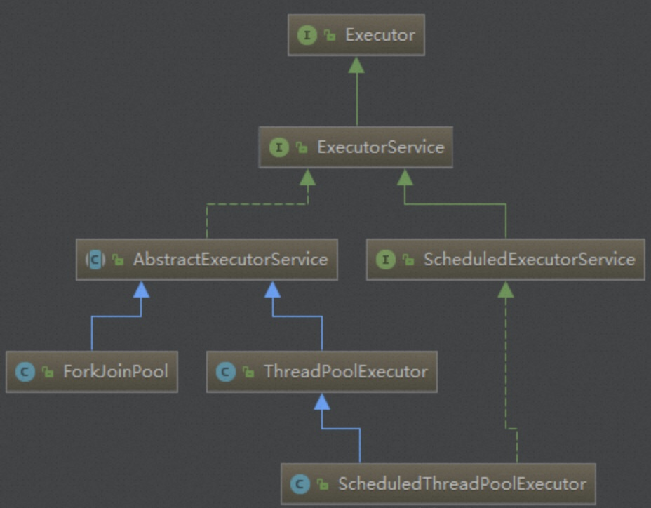
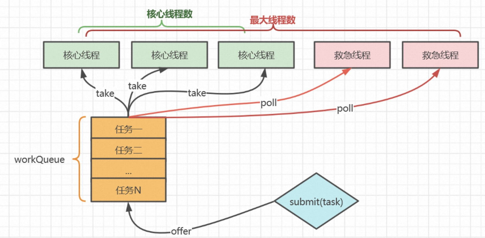
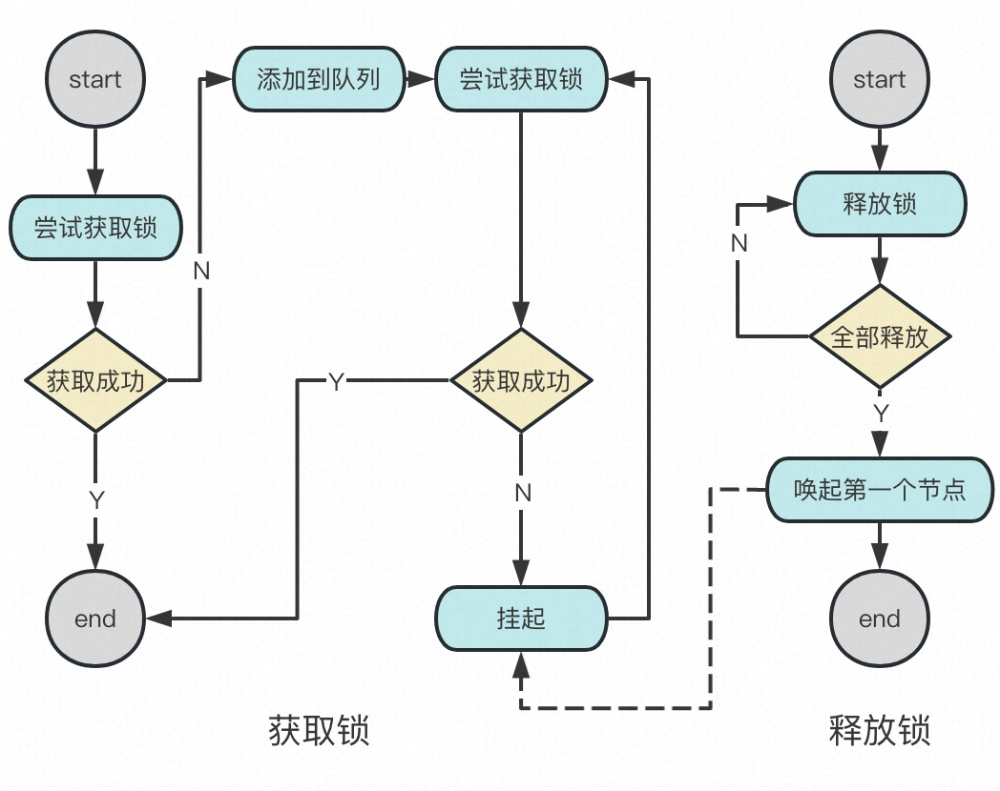
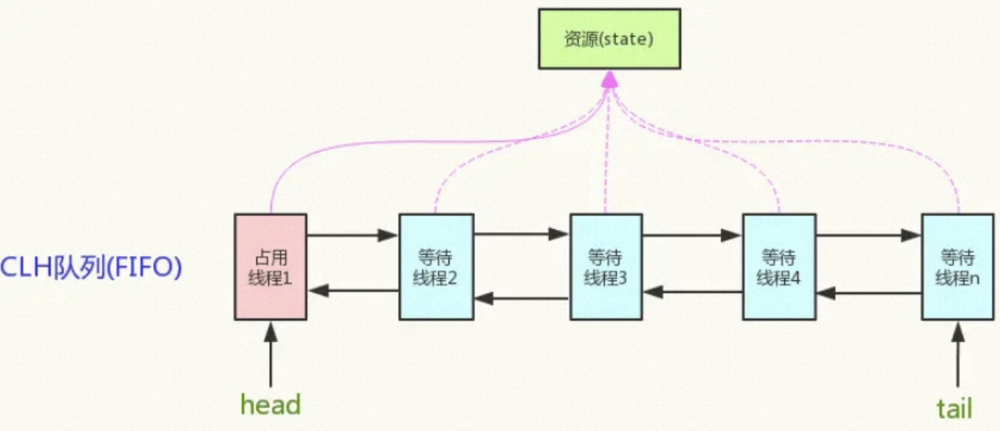

# 几种线程池
- ThreadPoolExecutor
- ThreadPoolTaskExecutor

# ThreadPoolExecutor
JDK线程池



## Runnable 和 Callable 区别
- Callable 比 Runnable 新
- Callable 支持返回结果
- Callable 支持抛出“检查型异常”
  
ThreadPoolExecutor的submit方法支持Runnable和Callable

但是Runnable在FutureTask里面会被包装成Callable：
```java
public FutureTask(Runnable runnable, V result) {
    this.callable = Executors.callable(runnable, result);
    this.state = NEW;       // ensure visibility of callable
}

public static <T> Callable<T> callable(Runnable task, T result) {
    if (task == null)
        throw new NullPointerException();
    return new RunnableAdapter<T>(task, result);
}

static final class RunnableAdapter<T> implements Callable<T> {
    final Runnable task;
    final T result;
    RunnableAdapter(Runnable task, T result) {
        this.task = task;
        this.result = result;
    }
    public T call() {
        task.run();
        return result;
    }
}
```

## 为什么使用线程池
- 降低系统资源消耗，提高系统响应速度，通过重用已存在的线程，降低线程创建和销毁造成的消耗
- 方便线程并发数的管控，因为线程若是无限制的创建，可能会导致内存占用过多而产生OOM，并且会造成cpu过度切换（cpu切换线程是有时间成本的，需要保持当前执行线程的现场，并恢复要执行线程的现场）
- 提供更强大的功能，延时定时线程池


## 一般用法
```java
// 创建
BlockingQueue<Runnable> workQueue = new LinkedBlockingQueue<>(1024);
NamedThreadFactory namedThreadFactory = new NamedThreadFactory("threadName");

ThreadPoolExecutor threadPool = new ThreadPoolExecutor(
    corePoolSize, // 核心线程数（最多保留的线程数），可以为0
    maximumPoolSize, // 线程池中的最大线程数量：corePoolSize + 救急线程数
    60L, // keepAliveTime: 线程执行完任务后的空闲时间 - 针对救急线程
    TimeUnit.SECONDS, // keepAliveTime的时间单位
    workQueue, // 任务队列，被提交但是尚未被执行的任务
    namedThreadFactory // 线程工厂，用于创建线程，一般情况下使用默认的
);

// 核心线程闲置时长超过keepAliveTime后也会被回收
threadPool.allowCoreThreadTimeOut(true);
// 拒绝策略
threadPool.setRejectedExecutionHandler(new ThreadPoolExecutor.AbortPolicy());

// 提交
threadPool.submit(new Runnable());
Future<T> future = threadPool.submit(new Callable<T>());

```

## 线程池参数详解
- corePoolSize + 救急线程数 <= maximumPoolSize
- 若当前线程池中线程数 < corePoolSize，则每来一个任务就创建一个线程去执行
- 若当前线程池中线程数 >= corePoolSize，会尝试将任务添加到任务队列
  - 如果添加成功，则任务会等待空闲线程将其取出并执行
  - 若队列已满，且当前线程池中线程数 < maximumPoolSize，创建新的线程，这类线程又叫救急线程（如果 corePoolSize == maximumPoolSize，表示不创建救急线程），救急线程有存活时间限制：keepAliveTime
- 若当前线程池中线程数 >= maximumPoolSize，则会采用拒绝策略（JDK提供了四种，下面会介绍）



## 配置策略
重点：每次提交新任务时，打印当前线程池状态，设置监控报警项，提供动态调整线程池参数能力。

- corePoolSize：每个任务需要tasktime秒处理，则每个线程每秒可处理1/tasktime个任务。系统每秒有tasks个任务需要处理，则需要的线程数为：tasks/(1/tasktime)。
即tasks*tasktime个线程数。假设系统每秒任务数为100到1000之间，每个任务耗时0.1秒，则需要100x0.1至1000x0.1，即10到100个线程。那么corePoolSize应该设置为大于10。
具体数字最好根据8020原则，即80%情况下系统每秒任务数，若系统80%的情况下任务数小于200，最多时为1000，则corePoolSize可设置为20。
- queueCapacity：任务队列的长度要根据核心线程数，以及系统对任务响应时间的要求有关。队列长度可以设置为(corePoolSize/tasktime)responsetime： (20/0.1)2=400，即队列长度可设置为400。如果队列长度设置过大，会导致任务响应时间过长，如以下写法：
LinkedBlockingQueue queue = new LinkedBlockingQueue();
这实际上是将队列长度设置为Integer.MAX_VALUE，将会导致线程数量永远为corePoolSize，再也不会增加，当任务数量陡增时，任务响应时间也将随之陡增。
- maxPoolSize：当系统负载达到最大值时，核心线程数已无法按时处理完所有任务，这时就需要增加线程。每秒200个任务需要20个线程，那么当每秒达到1000个任务时，则需要(1000-queueCapacity)*(20/200)，即60个线程，可将maxPoolSize设置为60


## 拒绝策略
- CallerRunsPolicy：直接在当前线程调用Runnable任务的run方法
- AbortPolicy：默认策略，抛RejectedExecutionException异常
- DiscardPolicy：抛弃新增的任务，啥都不干
- DiscardOldestPolicy：poll掉队列头（抛弃最老的），然后用线程池执行器ThreadPoolExecutor执行当前新增的任务
- 自定义拒绝策略

## 线程池等待所有任务完成的几种方式
- CountDownLatch
- Future
- CompletableFuture
  

```java
// 1. CountDownLatch
CountDownLatch latch = new CountDownLatch(taskNum);
for (int i=0; i<taskNum; i++) {
    threadPool.submit(() -> {
        try {

        } catch () {

        } finally {
            latch.countDown();
        }
    });
}
latch.await();

// 2. Future
Future<T> future = threadPool.submit(new Callable<T>());
T result = futrue.get();

// 3. CompletableFuture
List<CompletableFuture<T>> futures = new ArrayList<>();
ConcurrentLinkedQueue<T> queue = new ConcurrentLinkedQueue<>();
for (int i=0; i<taskNum; i++) {
    CompletableFuture<T> future = CompletableFuture.supplyAsync (() -> {
        
    }, threadPool).handle((result, throwable) -> {
    });
    future.whenComplete((result, throwable) -> queue.offer(result));
}

 CompletableFuture.allOf(futures.toArray(new CompletableFuture[0])).join();


```

## 底层原理
> https://www.cnblogs.com/theRhyme/p/13056215.html
```java
// 1. 线程提交后开始执行的流程：
public Future<?> submit(Runnable task)
  -> public void execute(Runnable command)
    -> private boolean addWorker(Runnable firstTask, boolean core)
      -> new Worker(firstTask)
        -> this.thread = getThreadFactory().newThread(this);
      ->  t.start();
        // woker继承了Runnable，作为线程开始run
        -> public void run()
          -> final void runWorker(Worker w)

// 2. Worker继承了AbstractQueuedSynchronizer，见后面AQS详解

// Worker重写了AQS的tryAcquire和tryRelease （通过state操作实现）
// Worker的lock()和unlock()来源于AQS，由AQS框架实现锁的获取与等待逻辑

// 注意：为什么runWorker里面要用lock包裹task.run()，或者为什么Worker要继承AQS：Worker的类注释解释了原因：避免其它线程interrupt当前线程打扰task的运行（interrupt来源于类似setCorePoolSize方法缩容核心线程数量，里面会先拿锁，再interrupt目标worker，目标worker如果正在执行task，锁不会释放，就不会被这种缩容线程interrupt），而不是避免多线程竞争资源


// 3. runWorker：线程池中线程被复用的关键

// 一直循环，当前任务执行完成之后置为null，再从队列里面取task执行
while (task != null || (task = getTask()) != null)

// 其中getTask()里面是个死循环：如果没有task了，worker是否释放看timeout设置
for (;;) {
    // ...
    boolean timed = allowCoreThreadTimeOut || wc > corePoolSize;
    // ...
    Runnable r = timed ?
        workQueue.poll(keepAliveTime, TimeUnit.NANOSECONDS) :
        workQueue.take();
    // workQueue.poll是非阻塞，没有的话，等keepAliveTime后就返回false
    // workQueue.take是阻塞，一直等着直到有新的task进来（或者被interrupt唤醒）
    if (r != null)
        return r;
    // ...
}
// 这里也回答了一个问题，为什么线程池用BlockingQueue：提供take方法，阻塞Worker获取Task，避免Worker退出带来的线程新增开销


```

## AQS
java.util.concurrent.ThreadPoolExecutor.Worker
继承了 AbstractQueuedSynchronizer

AbstractQueuedSynchronizer简称AQS，AQS是一个基于先进先出等待队列来实现阻塞锁和相关同步器的框架，我们日常中使用到的ReentrantLock、ReentrantReadWriteLock以及ArrayBlockingQueue等都是基于AQS实现的。

在日常的编程中我们经常会碰到并发的情况。有并发，就有资源共享；有资源共享就需要处理资源同步访问。处理同步的时候，就要处理竞争发生时候的等待问题以及竞争解除后的唤起的问题。AQS就是一个便于我们实现这种同步机制的框架。

我们可以设想一下，在没有AQS的情况下，我们要实现锁需要怎么做呢？

- 锁的状态是如何记录的，如何表示这个锁被持有的情况
- 如何获取锁
- 锁获取不到如何处理，直接返回，还是等待锁被释放。
- 如何释放锁
- 锁释放后，如何唤起哪些在等这个锁的线程。
- 共享锁、排他锁、公平锁、非公平锁，这些锁的特定如何处理。

在有AQS的情况下，又会是怎么样的呢？

AQS作为基础类，主要解决了在锁不能获取的情况下的等待，以及锁释放后的唤起。锁状态的定义，如何获取锁以及如何释放锁，都是需要相应的同步机制自己实现的。所以在使用AQS的时候，需要实现下面几个方法：

- tryAcquire()，获取排他锁
- tryRelease()，释放排他锁
- tryAcquireShared()，获取共享锁
- tryReleaseShared()，释放共享锁
- isHeldExclusively()：是不是持有排他锁（该线程是否正在独占资源），只有用到 condition 才需要去实现它。

以 ReentrantLock 为例，state 初始化为 0，表示未锁定状态。A 线程 lock() 时，会调用 tryAcquire() 独占该锁并将 state+1。此后，其他线程再 tryAcquire() 时就会失败，直到 A 线程 unlock() 到 state=0(即释放锁)为止，其它线程才有机会获取该锁。当然，释放锁之前，A 线程自己可以重复获取该锁(state 会累加)，这就是可重入的概念。获取多少次就要释放多么次，这样才能保证 state 是能回到零态的。

再以 CountDownLatch 为例，任务分为 N 个子线程去执行，state 也初始化为 N (注意 N 要与线程个数一致)。这 N 个子线程是并行执行的，每个子线程执行完后 countDown() 一次，state 会 CAS 减 1。等到所有子线程都执行完后(即 state=0)，会 unpark() 主调用线程，然后主调用线程就会从 await() 函数返回，继续后余动作。

一般来说，自定义同步器要么是独占，要么是共享，它们也只需实现 tryAcquire-tryRelease、tryAcquireShared-tryReleaseShared 中的一种即可。但 AQS 也支持自定义同步器同时实现独占和共享两种方式，如 ReentrantReadWriteLock。

AQS 有两种资源共享方式：Exclusive (独占，只有一个线程能执行，如ReentrantLock)和 Share (共享，多个线程可同时执行，如Semaphore/CountDownLatch)。它维护了一个 volatile int state(代表共享资源)和一个 FIFO 线程等待队列(多线程争用资源被阻塞时会进入此队列)。操作 state 的方法有三个：

- getState()
- setState()
- compareAndSetState()



### acquire 流程

- 调用自定义同步器的 tryAcquire() 尝试直接去获取资源，如果成功则直接返回(这里体现了非公平锁，每个线程获取锁时会尝试直接抢占加塞一次，而 CLH 队列中可能还有别的线程在等待)。
- 没有成功，addWaiter() 将该线程加入等待队列的尾部，并标记为独占模式。
- acquireQueued() 使线程阻塞在等待队列中获取资源，一直获取到资源后才返回。如果在整个等待过程中被中断过，则返回 true，否则返回 false。
- 如果线程在等待过程中被中断过，它是不响应的。只是获取资源后才再进行自我中断 selfInterrupt()，将中断补上。



### release 流程

- 调用自定义同步器的 tryRelease() 尝试直接去释放锁，如果失败则返回失败
- 如果成功，unpark（唤醒）头节点的下一个节点（这个节点加入到队列中以后被park阻塞着，等着被interrupt或者unpark唤醒）


  
# ThreadPoolTaskExecutor
Spring的线程池执行器，对ThreadPoolExecutor进行了封装处理

```java
@Configuration
public class ThreadPoolTaskConfig {
    @Bean("xxxTaskExecutor") // bean的名称，默认为首字母小写的方法名
    public ThreadPoolTaskExecutor taskExecutor(){
        ThreadPoolTaskExecutor executor = new ThreadPoolTaskExecutor();
        executor.setCorePoolSize(CORE_POOL_SIZE);
        executor.setMaxPoolSize(MAX_POOL_SIZE);
        executor.setQueueCapacity(QUEUE_CAPACITY);
        executor.setKeepAliveSeconds(KEEP_ALIVE_TIME);
        executor.setThreadNamePrefix(THREAD_NAME_PREFIX);

        // 线程池对拒绝任务的处理策略
        // CallerRunsPolicy：由调用线程（提交任务的线程）处理该任务
        executor.setRejectedExecutionHandler(new ThreadPoolExecutor.CallerRunsPolicy());

        // 初始化
        executor.initialize();
        return executor;
    }
}
```